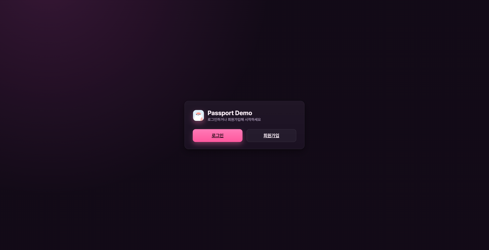

# Express-Authorization 모노레포

JWT(4000)와 Passport(3500)를 각각 앱으로 분리한 학습용 모노레포입니다.

## 빠른 시작

- 설치: `pnpm install`
- JWT 서버 실행: `pnpm start:jwt` (포트 4000)
- Passport 서버 실행: `pnpm start:passport` (포트 3500)
- 개발 모드(자동 재실행): `pnpm -F @apps/jwt dev`, `pnpm -F @apps/passport dev`

## 디렉터리 구조

```
.
├── apps/
│   ├── jwt/
│   │   ├── index.js          # JWT 서버 (4000)
│   │   ├── .env              # ACCESS/REFRESH 토큰 시크릿
│   │   └── package.json
│   └── passport/
│       ├── index.js          # Passport(Local/OAuth) 서버 (3500)
│       ├── config/
│       │   └── passport.js   # Local + Google 전략 설정
│       ├── controllers/
│       │   ├── users.controller.js
│       │   └── posts.controller.js (stub)
│       ├── routes/
│       │   ├── main.router.js
│       │   └── users.router.js
│       ├── models/
│       │   └── users.model.js
│       ├── middlewares/
│       │   └── auth.js
│       ├── views/            # EJS 템플릿
│       ├── public/           # 정적 파일
│       └── package.json
├── package.json               # 루트 스크립트
├── pnpm-workspace.yaml        # 워크스페이스 설정
└── pnpm-lock.yaml
```

## 앱별 안내

### apps/jwt (포트 4000)

- 환경변수 파일: `apps/jwt/.env`
  - `ACCESS_TOKEN_SECRET`
  - `REFRESH_TOKEN_SECRET`
- 주요 엔드포인트
  - `POST /login`: `{ "userName": "..." }` → accessToken 반환, refreshToken 쿠키 저장
  - `POST /refresh`: refreshToken 쿠키로 accessToken 재발급
  - `GET /posts`: Authorization 헤더 `Bearer <accessToken>` 필요
- 요청 예시
  - 로그인: `POST http://localhost:4000/login` body: `{ "userName": "user1" }`
  - 갱신: `POST http://localhost:4000/refresh` (쿠키 자동 전송 필요)
  - 조회: `GET http://localhost:4000/posts` 헤더: `Authorization: Bearer <token>`

### apps/passport (포트 3500)

- 환경변수 파일: `apps/passport/.env`
  - `MONGODB_URI`: MongoDB 연결 문자열
- LocalStrategy 데모(세션/뷰 사용)
- 엔드포인트 예시: 로그인/회원가입/성공 페이지 등
- 확장 아이디어
  - 세션/쿠키 기반 로그인 고도화(`passport.session()`, serialize/deserialize)
  - OAuth 추가(Google 등)
  - 로그인 성공 시 JWT 발급하여 JWT 서버와 연계

## UI 스크린샷 (Passport)

- 홈(최초 진입, 비로그인):

  

- 홈(로그인 상태):

  .png)

- 로그인 성공 화면:

  

- 로그인 화면:

  

- 회원가입 화면:

  

- MongoDB users 컬렉션(구글 로그인, 비밀번호 제거):

  

## 참고 사항

- 두 앱은 서로 독립 실행됩니다. 공통 패키지는 루트에 설치되어도 동작하지만, 필요 시 각 앱 `package.json` 기준으로 관리합니다.
- 환경변수는 각 앱 디렉터리에서 로드됩니다. `.env`는 각 앱 하위에 둡니다.

## 향후 학습/개선 가이드

- Passport에 세션 도입 후 직렬화/역직렬화 구현
- Google OAuth 2.0 연동 추가
- JWT Refresh Token 저장 전략(DB/Redis) 실험
- 역할(Role) 기반 접근 제어(RBAC) 적용
